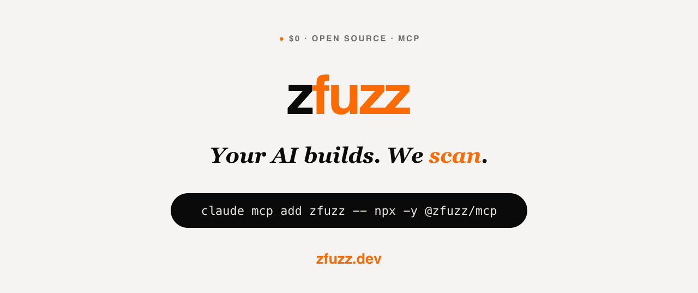

<div align="center">



</div>

# Zfuzz — security for everyone who builds with AI

**You ask. Your AI answers with real scanners — not guesses.**

Catch SQL injection, leaked API keys, and vulnerable dependencies **while you build** — no security background required. You don't run tools. You don't read dashboards. You just talk to your AI, and Zfuzz gives it real answers.

`$0` · **Apache-2.0** · No account · No API key · 100% local · Nothing leaves your machine

Made for **vibe coders and developers alike.** It plugs straight into the AI tools you already use — Cursor, Claude Code, Codex, Gemini CLI, OpenCode — and the web builders AI Studio, v0, and Lovable.

---

## ⚡ Add it in 10 seconds

**Pick your tool. Copy one line. Done.** No setup wizard, no account, no config to learn.

### Cursor — one click

[](cursor://anysphere.cursor-deeplink/mcp/install?name=zfuzz&config=eyJjb21tYW5kIjoibnB4IiwiYXJncyI6WyIteSIsIkB6ZnV6ei9tY3AiXX0=)

Click the button → Cursor opens → press **Install**. That's your two clicks.

### Claude Code

Paste this in the chat and hit enter:

```bash
claude mcp add zfuzz -- npx -y @zfuzz/mcp
```

### VS Code (Copilot)

```bash
code --add-mcp '{"name":"zfuzz","command":"npx","args":["-y","@zfuzz/mcp"]}'
```

### Codex

```bash
codex mcp add zfuzz npx -y @zfuzz/mcp
```

### Gemini CLI

```bash
gemini mcp add zfuzz npx -y @zfuzz/mcp
```

### Lovable · v0 · AI Studio — in your browser, no install

Open your tool's **MCP / Integrations** settings and paste this URL:

```
https://api.zfuzz.dev/mcp
```

<details>
<summary><b>Other tools</b> — OpenCode, Claude Desktop, or a manual config file</summary>

**Claude Desktop** — Settings → Developer → Edit Config, then add:

```json
{
  "mcpServers": {
    "zfuzz": { "command": "npx", "args": ["-y", "@zfuzz/mcp"] }
  }
}
```

**OpenCode** — add to `opencode.json`:

```json
{
  "mcp": {
    "zfuzz": { "type": "local", "command": ["npx", "-y", "@zfuzz/mcp"] }
  }
}
```

**Self-host the web (HTTP) endpoint** instead of using the hosted URL:

```bash
npx -y @zfuzz/mcp --transport http --port 8099
```

Then point your tool at `http://localhost:8099/mcp`.
_(Use port 8099, not 8090 — 8090 is the Zfuzz platform's own port.)_

</details>

That's it. Keep talking to your AI like normal — the first time your code needs a security check, it calls Zfuzz on its own.

---

## What it feels like

> **You:** Is my login page safe?
>
> **AI:** _[scans your file]_ Found 2 issues:
> 1. **SQL injection** on line 42 — anyone could read your whole database.
> 2. **No rate limiting** on the login — bots can guess passwords forever.
> Here's the fix… _[writes the patch]_

> **You:** Did I leave any passwords or keys in my code?
>
> **AI:** _[scans the project]_ Yes — your **OpenAI key** is hard-coded in `config.js`. Anyone who sees this repo can use it on your bill. Move it to an environment variable — here's how…

> **You:** Are the packages I installed safe?
>
> **AI:** _[checks your dependencies]_ 2 have known security holes. `lodash` lets attackers run code on your server. One command fixes both: `npm update lodash axios`.

You never typed a command, opened a scanner, or read a report. You just asked.

---

## You don't need to understand security

- You **never** run a scanner yourself — your AI does, automatically, when it matters.
- You **never** read a dashboard — answers come back in plain English, in your chat.
- You **never** pay and **nothing leaves your computer** — no account, no cloud, no API key.

**If you can copy-paste one line, you're covered.**

---

## What's under the hood

8 real tools your AI can call (it picks the right one — you don't have to):

| Tool | In plain English |
|------|------------------|
| `scan_code` | Finds bugs attackers exploit — 441 rules, 7 languages (Python, JS/TS, Go, Java, Rust, Ruby, PHP). |
| `scan_secrets` | Catches leaked passwords & API keys — 419 patterns (AWS, GitHub, Stripe, OpenAI, Anthropic…). |
| `scan_dependencies` | Flags packages with known security holes (CVEs via OSV.dev). |
| `scan_mcp_config` | Audits the AI tools/plugins you install for hidden malicious instructions. |
| `check_mitre` | Maps any finding to real-world attack techniques (MITRE ATT&CK). |
| `threat_model` | Asks "how could this be attacked?" across your whole project (STRIDE + MITRE). |
| `explain_finding` | Explains any vulnerability — and the fix — in everyday language. |
| `search_security_procedures` | Looks up 754 security playbooks (incident response, hardening, compliance). |

Built in **Rust** for sub-second answers. The AI brain is your editor's own model (Claude/GPT) — **Zfuzz adds the security muscle, not another subscription.**

---

## Why not Snyk or Semgrep?

| | Snyk / Semgrep | Zfuzz |
|---|---|---|
| **Where** | A pipeline, 5–10 min after you push | Right in your editor, in seconds |
| **When** | After the bug shipped | While you're writing it |
| **How** | A dashboard + email alerts | A normal conversation with your AI |
| **For non-coders** | No — built for security teams | **Yes — built for you** |
| **Cost** | $25–100 / dev / month | **Free, forever** |

---

## Free · Open · Local

No API keys. No cloud account. No telemetry. Runs 100% on your machine — your code never leaves it. Apache-2.0 licensed, open source.
---

## License

[Apache-2.0](LICENSE) — free & open source. © Zfuzz

Part of the [Zfuzz](https://zfuzz.dev) security platform.
